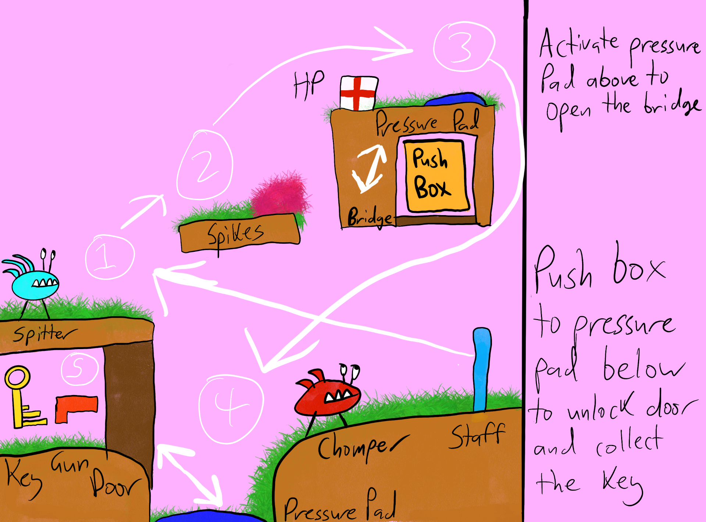
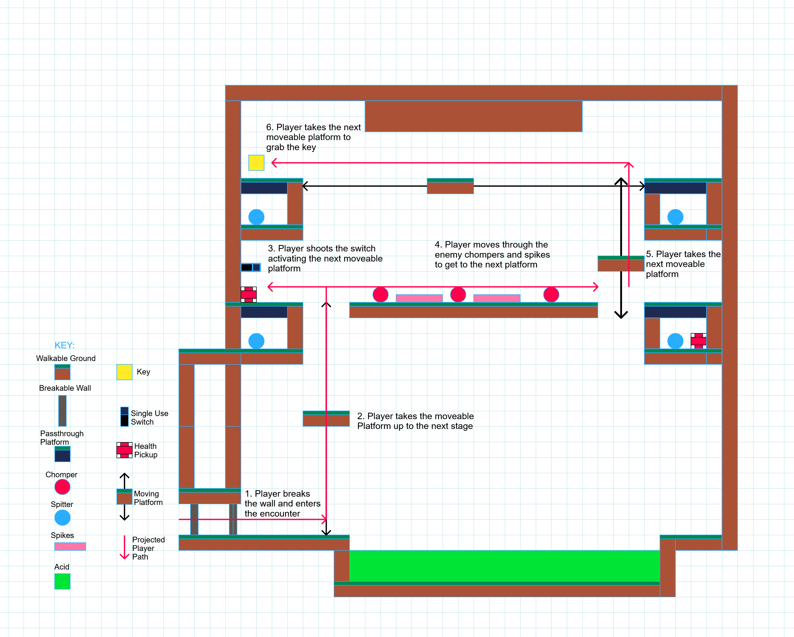

# COMP2150  - Level Design Document
### Name: Brendan Bone
### Student number: 47510595

This document discusses and reflects on the design of your platformer level for the Level Design assessment. It should be 1500 words. Make sure you delete this and all other instructional text throughout the document before checking your word count prior to submission. Hint: You can check word count by copying this text into a Word or Google doc.

Your document must include images. To insert an image into your documentation, place it in the "DocImages" folder in this repo, then place the below text where you want the image to appear:

```

```

Example:


## 1. Player Experience (~700 words)
Outline and justify how your level design facilitates the core player experience goals outlined in the assignment spec. Each section should be supported by specific examples and screenshots of your game encounters that highlight design choices made to facilitate that particular experience.

### 1.1. Discovery
What does the player learn? How does your encounter and broader level design facilitate learning in a way that follows good design practice?

I have tried to seperate mechanics to give the player a feel for them before encountering them in a challenge environment. For example the first section allows the player to see the spikes and spitter before using them together in a more intense situation. Another example is the door/cube at the start to let the player know they need it to keep the door open, this also helps the player with the first challenge section of the map.

### 1.2. Drama
What is the intensity curve? How does your design facilitate increasing yet modulating intensity, with moments of tension and relief? 

The intensity curve for each section starts slow to allow the player to adjust to the new section and its mechanics. However at the end we have multiple mechanics for a challenge which increases the drama and tension for the player. The moment of relief is when they get the key for that section and they get the walk back through the section they just went through before going to the next section. This makes sure theres no drama overload or underload for the player.

### 1.3. Challenge
What are the main challenges? How have you designed and balanced these challenges to control the difficulty curve and keep the player in the flow channel?

The main challenges are the small areas where the keys are, the reason these are the big challenges is because it combines several mechanics with multiple enemies. This provides pressure/tension to the player who may not have time to think/move around to solve the puzzle before being killed by the enemy.

### 1.4. Exploration
How does your level design facilitate autonomy and invite the player to explore? How do your aesthetic and layout choices create distinct and memorable spaces and/or places?

There are 2 main ways it invites the player to explore. The level is designed to force the player to go back the way they came to get to different parts they couldn't otherwise get to. An example of this is the 2 way route with the first moving platform, the 2nd area is only accessable once the player has the gun to shoot the switch to open the door. Another example is once they receive the staff from the 2nd section, this allows the player to return to the start to break the breakable wall to access the 3rd section.
Each section and layout choice is created in a distinctive way with multiple uses of sprite assets, local post volumes and open sections with backgrounds. This allows the player to know each section seperately.


## 2. Core Gameplay (~400 words)
A section on Core Gameplay, where storyboards are used to outline how you introduce the player to each of the required gameplay elements in the first section of the game. Storyboards should follow the format provided in lectures.

Storyboards can be combined when multiple mechanics are introduced within a single encounter. Each section should include a sentence or two to briefly justify why you chose to introduce the mechanic/s to the player in that sequence.

You should restructure the headings below to match the order they appear in your level.

### 2.1. Acid, Checkpoints, Chompers, Health pickups, Passthrough Platforms, Spikes, Spitters


The reason i chose to combine all these mechanics into this encounter is to provide a somewhat challenging but sraight forward encounter to introduce the player to these mechanics. I felt if they were individually alone in a level it won't be as engaging.

### 2.2. Moving Platforms


The reason i chose the moving platform here is to allow the player to use it to explore other locations within the level. The acid below it also adds an element of danger so they have to be careful.

### 2.3. Weapon Pickup (Gun), Weapon Pickup (Staff), Keys


The reason i chose the Weapon pickup (gun), Weapon Pickup (Staff) and one of the keys here is to have it as a reward for the player for completing this small but intense challenge. This gives the player tension as there is both enemy types to hinder the player from completing their objective and a small puzzle like challenge.


## 3. Spatiotemporal Design
A section on Spatiotemporal Design, which includes your molecule diagram and annotated level maps (one for each main section of your level). These diagrams may be made digitally or by hand, but must not be created from screenshots of your game. The annotated level maps should show the structure you intend to build, included game elements, and the path the player is expected to take through the level. Examples of these diagrams are included in the level design lectures.

No additional words are necessary for this section (any words should only be within your images/diagrams).
 
### 3.1. Molecule Diagram

### 3.2. Level Map – Section 1

### 3.3.	Level Map – Section 2

### 3.4.	Level Map – Section 3


## 4. Iterative Design (~400 words)
Reflect on how iterative design helped to improve your level. Additional prototypes and design artefacts should be included to demonstrate that you followed an iterative design process (e.g. pictures of paper prototypes, early grey-boxed maps, additional storyboards of later gameplay sequences, etc.). You can also use this section to justify design changes made in Unity after you drew your level design maps shown in section 3. 

You should conclude by highlighting a specific example of an encounter, or another aspect of your level design, that could be improved through further iterative design.

## Generative AI Use Acknowledgement

Use the below table to indicate any Generative AI or writing assistance tools used in creating your document. Please be honest and thorough in your reporting, as this will allow us to give you the marks you have earnt. Place any drafts or other evidence inside this repository. This form and related evidence do not count to your word count.
An example has been included. Please replace this with any actual tools, and add more as necessary.


### Tool Used: ChatGPT
**Nature of Use** Finding relevant design theory.

**Evidence Attached?** Screenshot of ChatGPT conversation included in the folder "GenAI" in this repo.

**Additional Notes:** I used ChatGPT to try and find some more relevant design theory that I could apply to my game. After googling them, however, I found most of them were inaccurate, and some didn't exist. One theory mentioned, however, was useful, and I've incorporated it into my work.

### Tool Used: Example
**Nature of Use** Example Text

**Evidence Attached?** Example Text

**Additional Notes:** Example Text


